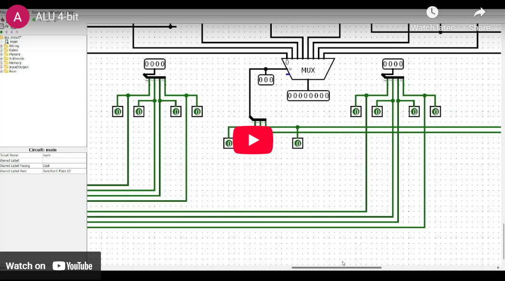
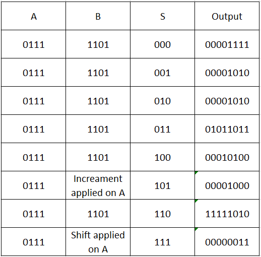
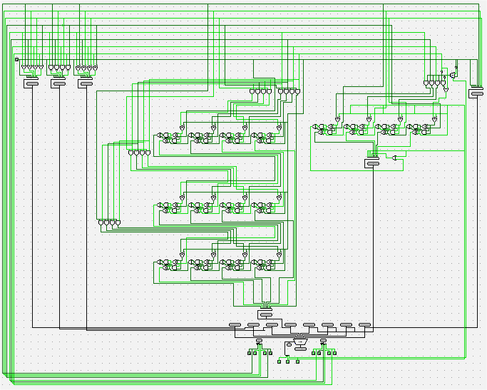
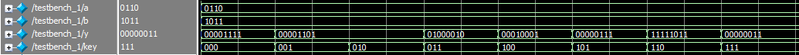
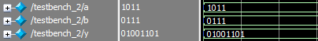
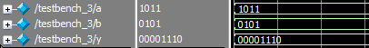

# 4-Bit ALU (Arithmetic Logic Unit) 🔢⚡

A complete 4-bit Arithmetic Logic Unit implementation using both hardware design (Logisim) and SystemVerilog structural modeling. The ALU performs 8 different operations including logical, arithmetic, and shift operations.

[](https://www.youtube.com/embed/4637It67shc?si=3gXPM5Bvdz2FMmLH)

## 📋 Description

This project demonstrates the design and implementation of a 4-bit ALU capable of performing 8 different operations. The ALU takes two 4-bit inputs (A and B), a 3-bit selection line (S2 S1 S0), and produces an 8-bit output (C). The project includes both hardware schematic design using Logisim and a complete SystemVerilog implementation using structural modeling.

<br>
<div align="center">
  <a href="https://codeload.github.com/TendoPain18/alu-4-bit/legacy.zip/main">
    
  </a>
</div>

## 🎯 Project Requirements

Design a 4-bit ALU that:
1. Has 4-bit inputs A & B
2. Has 3-bit selection line (S2, S1, S0)
3. Produces 8-bit output C
4. Performs 8 different operations based on selection bits

## ✨ Features

- **8 Operations**: Logical, arithmetic, and shift operations
- **Structural Design**: Built from basic logic gates (AND, OR, NAND, XOR, etc.)
- **Modular Architecture**: Reusable components (adders, multiplexers, etc.)
- **Complete Testing**: Three testbenches for thorough verification
- **Hardware Visualization**: Logisim circuit diagram
- **SystemVerilog Implementation**: Structural modeling approach

## 📊 ALU Operations

| S2 | S1 | S0 | Operation | Description | Output |
|----|----|----|-----------|-------------|--------|
| 0 | 0 | 0 | OR | Bitwise OR | C = A \| B |
| 0 | 0 | 1 | NAND | Bitwise NAND | C = (A & B)' |
| 0 | 1 | 0 | XOR | Bitwise XOR | C = A ^ B |
| 0 | 1 | 1 | Multiplication | 4-bit multiplication | C = A * B |
| 1 | 0 | 0 | Addition | Add A + B | C = A + B |
| 1 | 0 | 1 | Increment | Increment A | C = A + 1 |
| 1 | 1 | 0 | Subtraction | Subtract B from A | C = A - B |
| 1 | 1 | 1 | Shift Right | Logical right shift | C = A >> 1 |

**Notes:**
- For arithmetic operations (Add, Inc, Sub): Overflow bit is neglected
- For logical operations: Upper 4 bits of output are zero-padded
- Shift right adds 0 to the MSB position

## 🏗️ Architecture

### Truth Table



*Truth table showing all 8 operations for A = 0111 (7) and B = 1101 (13)*

**Test Case:** A = 4'b0111, B = 4'b1101
- S = 000 (OR): Output calculated
- S = 001 (NAND): Output calculated
- S = 010 (XOR): Output calculated
- S = 011 (Multiplication): Output calculated
- S = 100 (Addition): Output calculated
- S = 101 (Increment): Output calculated
- S = 110 (Subtraction): Output calculated
- S = 111 (Shift Right): Output calculated

### Circuit Design



*Hardware schematic diagram designed in Logisim*

### Module Hierarchy
```
ALU (Top Module)
├── or_operation
│   └── or2 gates (4x)
├── nand_operation
│   └── nand2 gates (4x)
├── xor_operation
│   └── xor2 gates (4x)
├── multiplication_operation
│   ├── and2 gates (16x)
│   └── add_sub_4_bit (3x)
│       └── full_adder (4x each)
│           └── half_adder (2x each)
├── add_inc_sub_operation
│   ├── mux_2to1
│   └── add_sub_4_bit
├── shift_right_operation
│   └── shift_right_one
└── mux_8to1 (Final output selection)
```

### Basic Components

The ALU is built using these fundamental modules:

**Logic Gates:**
- `and2` - 2-input AND gate
- `or2` - 2-input OR gate
- `nand2` - 2-input NAND gate
- `nor2` - 2-input NOR gate
- `xor2` - 2-input XOR gate
- `xnor2` - 2-input XNOR gate
- `inv` - Inverter (NOT gate)
- `buffer` - Buffer

**Arithmetic Components:**
- `half_adder` - Adds two 1-bit numbers
- `full_adder` - Adds three 1-bit numbers (with carry)
- `add_sub_4_bit` - 4-bit adder/subtractor with carry

**Data Path Components:**
- `mux_2to1` - 2-to-1 multiplexer (4-bit)
- `mux_8to1` - 8-to-1 multiplexer (8-bit)
- `shift_right_one` - Logical right shift by 1 bit

## 🔬 Simulation & Testing

### Test Cases

**Testbench 1: Complete ALU Test**
- Tests all 8 operations sequentially
- Input: A = 4'b0110 (6), B = 4'b1011 (11)
- Cycles through all selection combinations (S = 000 to 111)



**Testbench 2: Multiplication Operation**
- Focused test on multiplication
- Input: A = 4'b1011 (11), B = 4'b0111 (7)
- Expected Output: 77 (8'b01001101)



**Testbench 3: NAND Operation**
- Focused test on NAND operation
- Input: A = 4'b1011 (11), B = 4'b0101 (5)
- Tests bitwise NAND functionality



### Running Simulations

**Using ModelSim/QuestaSim:**
```bash
# Compile the design
vlog system-verilog/code.sv

# Run testbench 1 (Complete ALU test)
vsim testbench_1
run -all

# Run testbench 2 (Multiplication test)
vsim testbench_2
run -all

# Run testbench 3 (NAND test)
vsim testbench_3
run -all
```

**Using Vivado:**
```bash
# Add source files
add_files system-verilog/code.sv

# Run simulation
launch_simulation
run all
```

## 🛠️ Implementation Details

### Multiplication Operation

The 4-bit multiplication is implemented using the shift-and-add method:
```
    A3 A2 A1 A0
  × B3 B2 B1 B0
  ─────────────
    Partial products (4 rows)
  + Accumulated using three 4-bit adders
  ─────────────
    P7 P6 P5 P4 P3 P2 P1 P0
```

### Add/Subtract Operation

The adder/subtractor uses 2's complement arithmetic:
- **Addition (SUB=0)**: Direct addition of A + B
- **Subtraction (SUB=1)**: A + (~B) + 1 (2's complement)
- **Increment (INC=1)**: A + 1 (B is replaced with 0001)

### Shift Right Operation

Logical right shift by 1 bit:
```
Input:  A3 A2 A1 A0
Output:  0 A3 A2 A1
```

## 📁 Project Files
```
4-bit-alu/
│
├── system-verilog/
│   └── code.sv                    # Complete SystemVerilog implementation
│
├── logisim/
│   └── alu_circuit.circ          # Logisim circuit file
│
├── images/
│   ├── truth_table.png           # Operation truth table
│   ├── logisim_circuit.png       # Hardware schematic
│   ├── testbench_1.png           # Complete ALU test results
│   ├── testbench_2.png           # Multiplication test results
│   ├── testbench_3.png           # NAND test results
│   └── youtube_window_1.png      # Demo video thumbnail
│
└── README.md
```

## 🚀 Getting Started

### Prerequisites

**For Simulation:**
- ModelSim/QuestaSim or
- Xilinx Vivado or
- Any SystemVerilog-compatible simulator

**For Hardware Design:**
- Logisim (or Logisim Evolution)

### Running the Project

1. **Clone the repository**
```bash
git clone https://github.com/yourusername/4-bit-alu.git
cd 4-bit-alu
```

2. **Open in Logisim**
```bash
# Open the circuit file
logisim logisim/alu_circuit.circ
```

3. **Simulate in SystemVerilog**
```bash
# Using your preferred simulator
vlog system-verilog/code.sv
vsim testbench_1
run -all
```

## 🎓 Learning Outcomes

This project demonstrates:

1. **Digital Logic Design**: Building complex circuits from basic gates
2. **Structural Modeling**: Hierarchical design in SystemVerilog
3. **ALU Architecture**: Understanding processor arithmetic units
4. **Multiplexing**: Using multiplexers for operation selection
5. **Arithmetic Circuits**: Implementing adders and multipliers
6. **Testing & Verification**: Writing comprehensive testbenches
7. **Hardware Visualization**: Creating schematic diagrams

## 🔄 Design Methodology

### Structural Modeling Approach

All components are built using **structural modeling** in SystemVerilog:
- No behavioral constructs (always blocks, if-else, case)
- Only module instantiation and wire connections
- Mimics actual hardware implementation
- Clear mapping to physical gates

### Example: XOR Gate Implementation
```systemverilog
module xor2 (
    input logic a, b,
    output logic y);
    
    logic a_inv, b_inv, and1, and2;
    
    inv inv_gate_a (a, a_inv);        // a'
    inv inv_gate_b (b, b_inv);        // b'
    and2 and_gate1 (a, b_inv, and1);  // a·b'
    and2 and_gate2 (a_inv, b, and2);  // a'·b
    or2 or_gate (and1, and2, y);      // (a·b') + (a'·b)
endmodule
```

## 📈 Performance Characteristics

| Operation | Gate Delay | Critical Path |
|-----------|------------|---------------|
| OR | 1 gate | OR gate |
| NAND | 2 gates | AND + INV |
| XOR | 4 gates | 2 INV + 2 AND + 1 OR |
| Multiplication | ~20 gates | Multiple adder stages |
| Addition | ~8 gates | 4-bit ripple carry |
| Subtraction | ~9 gates | XOR + 4-bit adder |
| Increment | ~8 gates | 4-bit adder |
| Shift Right | 0 gates | Direct wiring |

## 🤝 Contributing

Contributions are welcome! Feel free to:

- Add more ALU operations
- Optimize critical paths
- Implement pipelining
- Add more test cases
- Improve documentation
- Create additional visualizations

## 📄 License

This project is licensed under the MIT License - see the [LICENSE](LICENSE) file for details.

## 🙏 Acknowledgments

- Course project for Digital Logic Design
- Built using structural modeling principles
- Logisim for circuit visualization
- SystemVerilog for hardware description

<br>
<div align="center">
  <a href="https://codeload.github.com/TendoPain18/alu-4-bit/legacy.zip/main">
    
  </a>
</div>

## <!-- CONTACT -->
<div id="toc" align="center">
  <ul style="list-style: none">
    <summary>
      <h2 align="center">
        🚀
        CONTACT ME
        🚀
      </h2>
    </summary>
  </ul>
</div>
<table align="center" style="width: 100%; max-width: 600px;">
<tr>
  <td style="width: 20%; text-align: center;">
    <a href="https://www.linkedin.com/in/amr-ashraf-86457134a/" target="_blank">
      
    </a>
  </td>
  <td style="width: 20%; text-align: center;">
    <a href="https://github.com/TendoPain18" target="_blank">
      
    </a>
  </td>
  <td style="width: 20%; text-align: center;">
    <a href="mailto:amrgadalla01@gmail.com">
      
    </a>
  </td>
  <td style="width: 20%; text-align: center;">
    <a href="https://www.facebook.com/amr.ashraf.7311/" target="_blank">
      
    </a>
  </td>
  <td style="width: 20%; text-align: center;">
    <a href="https://wa.me/201019702121" target="_blank">
      
    </a>
  </td>
</tr>
</table>
<!-- END CONTACT -->

## **Experience the power of digital logic design! ⚡✨**
